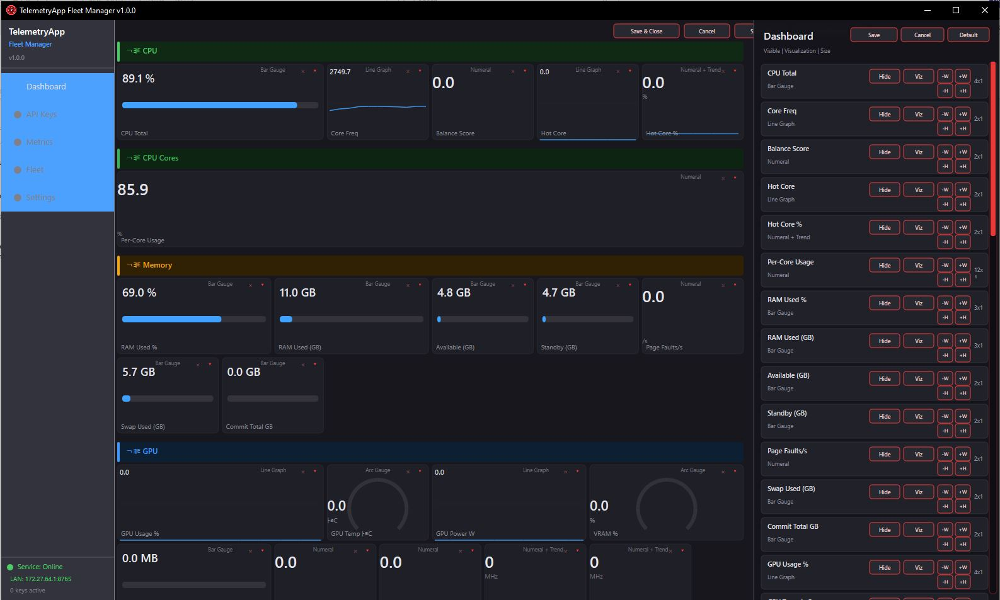
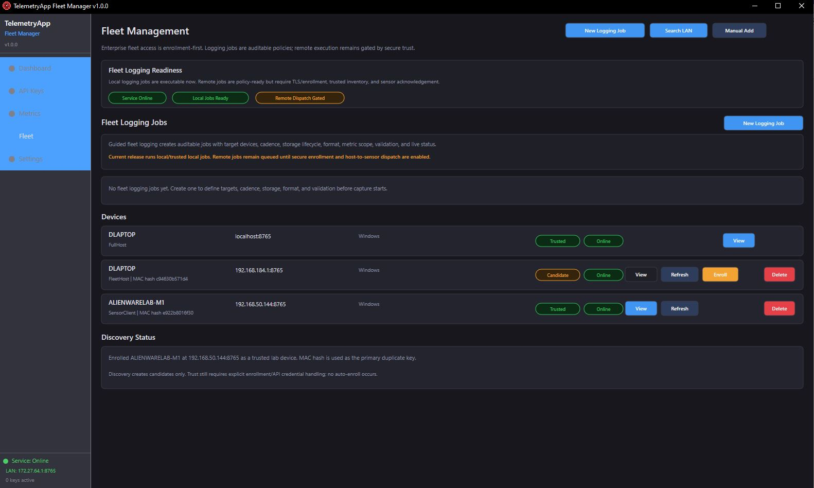
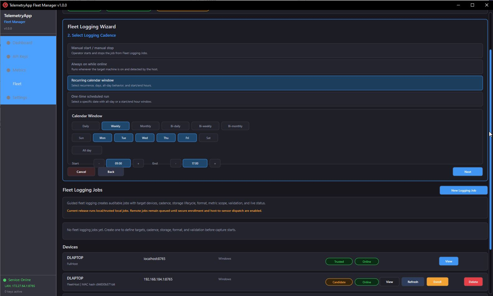

# TelemetryApp GitHub Export

This folder is a clean export staging area for the current native Windows TelemetryApp release.

## Contents

- `source/WINAPP/` - open source native Windows application source, build scripts, installer script, README, and license.
- `standalone/TelemetryApp_Portable/` - portable standalone runtime package built from the current source.
- `installer/TelemetryApp_Setup_1.0.0.exe` - NSIS installer built from the current source and portable payload.
- `screenshots/` - UI screenshots for the GitHub repository and release page.
- `SHA256SUMS.txt` - checksums for the installer and primary standalone executables.

## Current Product Truth

TelemetryApp is currently strongest as a local-first Windows telemetry tool for small labs, AI/data-processing workstations, and technician-managed device groups. Fleet discovery, explicit lab enrollment, remote snapshot/logging hooks, and heartbeat call-home for changed sensor IP addresses are implemented. Enterprise-grade remote telemetry still requires one-time tokens, TLS/mTLS, certificate pinning, and formal inventory policy.

## Push Readiness

The source, standalone package, installer, README, API guide, license, and project matrix are present in this export. Before publishing a public GitHub release, review:

- Whether binary artifacts should be committed to the repository, attached as GitHub Release assets, or both.
- Whether older non-WINAPP project folders should remain excluded from the first public export.
- Whether release notes should explicitly mark remote fleet telemetry dispatch, electrical metering, cache telemetry, and enterprise TLS/mTLS as planned features.

Recommended repository shape:

```text
TelemetryApp/
  source/WINAPP/
  standalone/TelemetryApp_Portable/
  installer/TelemetryApp_Setup_1.0.0.exe
  screenshots/
  README.md
  SHA256SUMS.txt
```

## Screenshots






